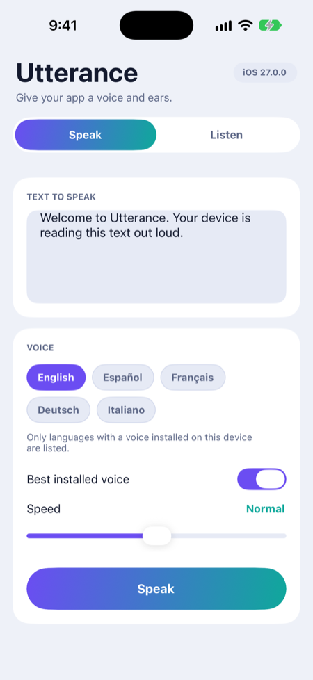
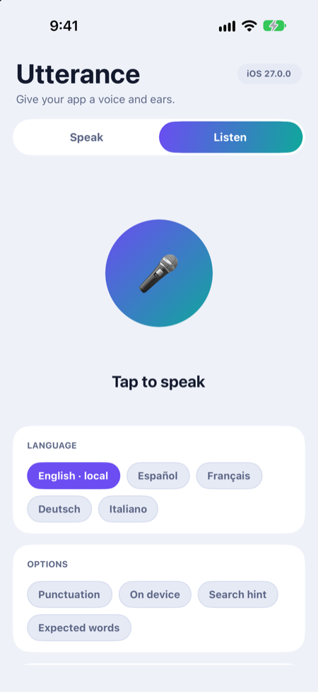
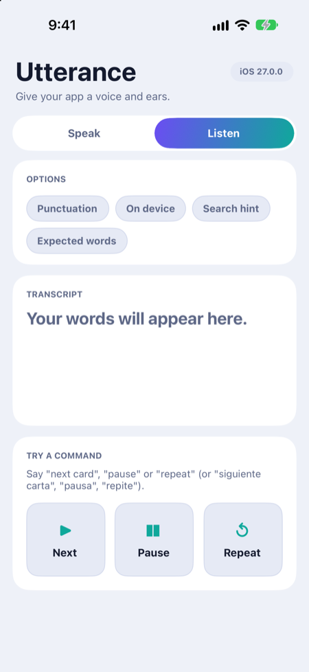
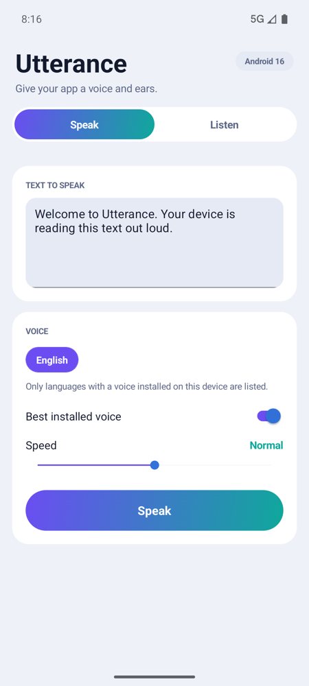
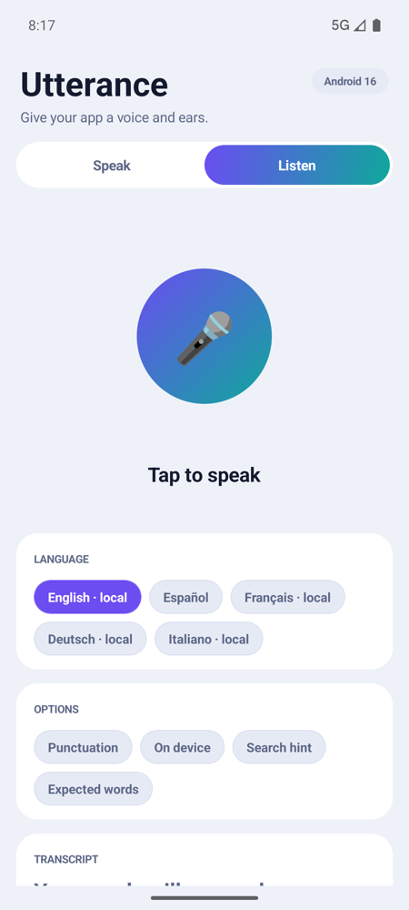
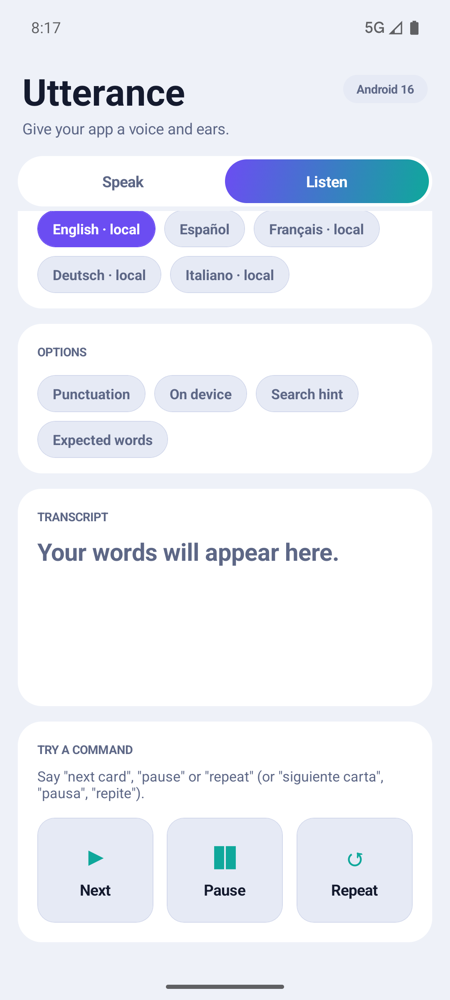

# Utterance v4.1
### Text-to-speech and speech-to-text for Titanium

[](https://opensource.org/licenses/Apache-2.0) [](https://github.com/macCesar/Utterance)

Utterance v4.1 requires Titanium SDK 13.0.0 on both platforms. Since v3.2 it keeps text-to-speech off Android's main thread and lets you list the installed voices, pick one, or let the module choose the best one for a language.

## Changelog

See [CHANGELOG.md](CHANGELOG.md) for what changed in each version.

## Requirements

| Platform     | Minimum        | Recommended     |
| ------------ | -------------- | --------------- |
| Titanium SDK | 13.0.0+        | Latest          |
| iOS          | 15.0+          | Latest          |
| Android      | 7.0+ (API 24+) | 10.0+ (API 29+) |
| Xcode        | 13.0+          | Latest          |
| Android SDK  | Target API 33+ | Latest          |

## Installation

### Download the compiled module
- [Releases](https://github.com/macCesar/Utterance/releases): each release has the iOS and Android zips attached
- [iOS dist folder](https://github.com/macCesar/Utterance/tree/main/ios/dist)
- [Android dist folder](https://github.com/macCesar/Utterance/tree/main/android/dist)

### Setup
1. Download the latest release for your platforms.
2. Install the module in your Titanium project.
3. Add it to `tiapp.xml`:

```xml
<modules>
  <module platform="iphone">bencoding.utterance</module>
  <module platform="android">bencoding.utterance</module>
</modules>
```

4. Add permissions to `tiapp.xml`. Text-to-speech needs none; speech-to-text needs the microphone:
```xml
<ios>
  <plist>
    <dict>
      <!-- Required for Speech-to-Text (STT) -->
      <key>NSMicrophoneUsageDescription</key>
      <string>This app uses voice recognition to convert speech to text.</string>

      <key>NSSpeechRecognitionUsageDescription</key>
      <string>This app uses speech recognition for voice commands.</string>
    </dict>
  </plist>
</ios>

<android xmlns:android="http://schemas.android.com/apk/res/android">
  <manifest>
    <!-- Required for Speech-to-Text (STT) -->
    <uses-permission android:name="android.permission.RECORD_AUDIO"/>
    <uses-permission android:name="android.permission.INTERNET"/>

    <!-- Optional: For better speech recognition performance -->
    <uses-permission android:name="android.permission.ACCESS_NETWORK_STATE"/>
  </manifest>
</android>
```

5. Require the module:

```javascript
const utterance = require('bencoding.utterance');
```

## Quick start

### Text-to-speech (iOS and Android)

```javascript
const utterance = require('bencoding.utterance');
const speech = utterance.createSpeech();

// Simple speech with modern API
speech.startSpeaking({
  text: "Hello! This is Utterance v4.0 with cross-platform consistency!"
});

// Advanced configuration with standardized rates
speech.startSpeaking({
  text: "This speech uses perceptually equivalent rates across platforms",
  rate: speech.SLOW_SPEECH_RATE,  // Sounds equally slow on iOS and Android
  voice: "en-US"
});
```

### Speech-to-text

`startSpeechToText()` listens from the microphone inside the app on both platforms. There is no system dialog, so the app shows its own indicator, such as a button that changes while it listens. `stopRecording()` ends the audio and `completed` delivers the transcript. `partial` delivers the text while the person is still talking, and `cancelRecording()` drops the session.

```javascript
const utterance = require('bencoding.utterance');
const speechToText = utterance.createSpeechToText();

speechToText.addEventListener('partial', (event) => {
  console.log("So far:", event.text);
});

speechToText.addEventListener('completed', (event) => {
  if (!event.success) {
    console.warn(event.code, event.message);
    return;
  }
  console.log(event.text, event.confidence);
});

function listen() {
  speechToText.startSpeechToText({ language: "es-MX" }); // language is optional
}

if (!speechToText.isSupported()) {
  console.warn("Speech-to-Text not supported on this device");
} else if (speechToText.getPermissionStatus().granted) {
  listen();
} else {
  speechToText.addEventListener('permissions', (event) => event.granted && listen(), { once: true });
  speechToText.requestPermissions();
}

// Later, when the user is done speaking:
speechToText.stopRecording();
```

The default language is the system language on iOS (when `SFSpeechRecognizer` supports it, otherwise `en-US`) and the device language on Android. The session ends by itself after a pause. `silenceTimeout` (seconds of silence after speech) and `noSpeechTimeout` (seconds to wait for speech) adjust it on both platforms, and 0 turns either one off. Without them, iOS uses 2 and 6 seconds, and Android leaves the choice to the recognizer.

The same options work on both platforms where the platform has the feature: `taskHint`, `contextualStrings`, `onDevice`, `punctuation`, `segments` and `alternatives`. `transcribeFile()` and `appendAudio()` transcribe audio that does not come from the microphone. Failures carry a stable `code`. The [speech-to-text guide](documentation/speech_to_text.md) has every option, the error codes and what was tried on each platform.

## Demo app

`ios/example/app.js` and `android/example/app.js` (the two files are identical) are one demo app with two tabs. Speak reads a text aloud with the voice, language and speed you pick. Listen shows the speech-to-text API: live text while you talk, a command acted on as soon as it is heard, a level indicator, the languages that work without a connection, and the options for punctuation, on-device recognition, the search hint and expected words.

To run it, copy `app.js` and `semantic.colors.json` (in the same folder) to the `Resources` folder of a Titanium app that includes the module. The comment at the top of `app.js` lists what `tiapp.xml` needs. The colors follow the system's light or dark mode.

| | Speak | Listen | Listen, scrolled |
| --- | --- | --- | --- |
| iOS |  |  |  |
| Android |  |  |  |

Captured on an iPhone 18 Pro simulator (iOS 27) and a Pixel 8 emulator (Android 16), in English and light mode.

## Features

### Speech rate on both platforms

Since v3.0, each rate constant sounds about as fast on iOS as on Android, although the underlying values differ.

```javascript
const speech = utterance.createSpeech();

// These constants sound perceptually equivalent across platforms
const rateConstants = {
  VERY_SLOW: speech.VERY_SLOW_SPEECH_RATE,    // iOS: 0.25, Android: 0.4
  SLOW: speech.SLOW_SPEECH_RATE,              // iOS: 0.35, Android: 0.6
  NORMAL: speech.DEFAULT_SPEECH_RATE,         // iOS: 0.5,  Android: 1.0
  FAST: speech.FAST_SPEECH_RATE,              // iOS: 0.55, Android: 1.3
  VERY_FAST: speech.VERY_FAST_SPEECH_RATE     // iOS: 0.65, Android: 1.6
};

// Use the same rate value on both platforms for consistent user experience
speech.startSpeaking({
  text: "This sounds the same speed everywhere!",
  rate: rateConstants.SLOW
});
```

### Voice selection (v3.0+)

```javascript
const speech = utterance.createSpeech();

// Get detailed voice information
const voices = speech.getModernVoices();

// Filter high-quality Spanish voices
const spanishVoices = voices.filter(voice => {
  const lang = voice.language || voice.locale || '';
  return lang.toLowerCase().includes('es') && voice.quality > 300;
});

if (spanishVoices.length > 0) {
  speech.startSpeaking({
    text: "¡Hola! Este es un ejemplo en español con voces de alta calidad.",
    voice: spanishVoices[0].name,
    rate: speech.DEFAULT_SPEECH_RATE
  });
}
```

### Speech-to-text events

```javascript
const speechToText = utterance.createSpeechToText();

speechToText.addEventListener('started', () => {
  console.log("The microphone is open");
});

speechToText.addEventListener('partial', (event) => {
  console.log("So far:", event.text);
});

speechToText.addEventListener('completed', (event) => {
  if (event.success && event.detectedInput) {
    console.log("Best transcription:", event.text);
    console.log("Alternatives:", event.words); // best first
  } else {
    console.warn(event.code, event.message);
  }
});

speechToText.startSpeechToText({ language: "es-MX" });
```

## API reference

### Text-to-speech methods

| Method                     | Platform      | Description                                               |
| -------------------------- | ------------- | --------------------------------------------------------- |
| `startSpeaking(options)`   | iOS, Android  | Start speaking                                            |
| `pauseSpeaking(boundary?)` | iOS, Android* | Pause the current speech                                  |
| `continueSpeaking()`       | iOS, Android* | Resume paused speech                                      |
| `stopSpeaking(boundary?)`  | iOS, Android  | Stop the current speech                                   |
| `isSpeaking`               | iOS, Android  | Property: whether speech is in progress (both since v3.0) |
| `isSpeaking()`             | iOS, Android  | Method: whether speech is in progress (both since v3.0)   |
| `isSupported()`            | iOS, Android  | Whether the platform supports TTS (both since v3.0)       |
| `getModernVoices()`        | iOS, Android  | Detailed voice information (v3.0+)                        |
| `requestVoices()`          | iOS, Android  | Installed voices, delivered in a `voices` event (v3.2.0)  |
| `getVoices()`              | iOS, Android  | Basic voice list (legacy)                                 |

*\*Android sends the events but does not pause or resume the speech.*

`startSpeaking()` options added in v3.2.0: `voiceId`, `bestVoice` and `queue`. See the [changelog](CHANGELOG.md).

*On Android, `getModernVoices()`, `getModernLanguages()`, `isLanguageAvailable()`, `isNetworkRequired()`, `getEngineInfo()` and `getDiagnostics()` return data from the engine, so they wait for it while it connects. Call them after the `initialized` event, not from a click handler.*

#### Same API on both platforms since v3.0

Before v3.0, `isSpeaking` was a method on Android and a property on iOS, so code had to check the platform:
```javascript
// ❌ OLD: Had to write platform-specific code
if (Ti.Platform.osname === 'android') {
  if (speech.isSpeaking()) { /* Android: method only */ }
  if (speech.isSupported()) { /* Android: had this method */ }
} else if (Ti.Platform.osname === 'iphone') {
  if (speech.isSpeaking) { /* iOS: property only */ }
  if (speech.isSupported()) { /* iOS: had this method */ }
}
```

Since v3.0, the same code runs on both:
```javascript
// ✅ NEW: Same code works perfectly on both platforms!
if (speech.isSpeaking) {        // Property: works everywhere
  console.log("Speaking via property");
}

if (speech.isSpeaking()) {      // Method: now works everywhere
  console.log("Speaking via method");
}

if (speech.isSupported()) {     // Method: confirmed working everywhere
  console.log("TTS is supported");
}
```

Use the property or the method, whichever you prefer. Existing code keeps working.

### Speech-to-text methods

| Method                                | Platform         | Description                                                                       |
| ------------------------------------- | ---------------- | --------------------------------------------------------------------------------- |
| `isSupported()`                       | iOS, Android     | Whether the platform supports speech recognition                                  |
| `isAvailable(language?)`              | iOS, Android     | Whether recognition can run now (Android ignores the language)                    |
| `supportsOnDevice(language?)`         | iOS, Android     | Whether it can run without the network (Android ignores the language)             |
| `startSpeechToText(options?)`         | iOS, Android     | Start listening. See the [guide](documentation/speech_to_text.md) for the options |
| `stopRecording()`                     | iOS, Android     | Stop listening and deliver the transcript in `completed`                          |
| `cancelRecording()`                   | iOS, Android     | Drop the session: `canceled` fires and `completed` does not                       |
| `transcribeFile(file, options?)`      | iOS, Android 13+ | Transcribe a recorded file                                                        |
| `appendAudio(data)`                   | iOS, Android 13+ | Send PCM audio to a session started with `audioSource: 'buffer'`                  |
| `getNativeAudioFormat()`              | iOS, Android     | The audio format the recognizer prefers                                           |
| `getPermissionStatus()`               | iOS, Android     | The microphone (and on iOS speech recognition) permission state                   |
| `requestPermissions()`                | iOS, Android     | Ask for the permissions; the `permissions` event answers                          |
| `requestSupportedLanguages()`         | iOS, Android     | The `languages` event lists them and which ones work without the network          |
| `downloadLanguage({ language })`      | Android 13+      | Download an on-device model; `download` events report it                          |
| `getState()`                          | iOS              | State of the recognition task                                                     |
| `prepareCustomLanguageModel(options)` | iOS 17+          | Prepare a custom language model; the `languagemodel` event answers                |

## Events

### Text-to-speech events

| Event       | Platform      | Description                                                                 |
| ----------- | ------------- | --------------------------------------------------------------------------- |
| `started`   | iOS, Android  | Speech synthesis has started                                                |
| `completed` | iOS, Android  | Speech synthesis completed; with `queue: true`, once the whole queue ends   |
| `voices`    | iOS, Android  | Reply to `requestVoices()`: `{ voices: [{ id, name, language, quality }] }` |
| `paused`    | iOS, Android* | Speech synthesis paused                                                     |
| `continued` | iOS, Android* | Speech synthesis resumed                                                    |
| `stopped`   | iOS, Android  | `stopSpeaking()` stopped the speech                                         |
| `canceled`  | iOS, Android  | Speech synthesis canceled                                                   |

### Speech-to-text events

| Event                      | Platform     | Description                                                                    |
| -------------------------- | ------------ | ------------------------------------------------------------------------------ |
| `started`                  | iOS, Android | The audio is flowing and recognition has started                               |
| `partial`                  | iOS, Android | The text recognized so far: `{ text, words }`                                  |
| `speechstart`, `speechend` | iOS, Android | The speech started and ended                                                   |
| `audiolevel`               | iOS, Android | `{ level, decibels }`, with `level` from 0 to 1                                |
| `completed`                | iOS, Android | Recognition finished, or failed: check `success` and read `code` and `message` |
| `canceled`                 | iOS, Android | `cancelRecording()` dropped the session                                        |
| `permissions`              | iOS, Android | Answer to `requestPermissions()`                                               |
| `languages`                | iOS, Android | Answer to `requestSupportedLanguages()`                                        |
| `audioduration`            | iOS          | Seconds of audio processed so far                                              |
| `availability`             | iOS          | The recognizer became available or unavailable                                 |
| `languagemodel`            | iOS          | Answer to `prepareCustomLanguageModel()`                                       |
| `download`                 | Android      | Progress of `downloadLanguage()`                                               |
| `segmentresult`            | Android      | One piece of a `segmentedSession`                                              |
| `languagedetected`         | Android      | The recognizer detected the spoken language                                    |

Events fire only when a listener exists at that moment, and right after the call that caused them returns, not inside it.

`completed` on success: `{ success: true, text, confidence, words, wordCount, detectedInput, language, source }`, plus `segments`, `alternatives`, `metadata` and `voiceAnalytics` when asked for. On failure: `{ success: false, message, code, detectedInput: false, wordCount: 0, words: [] }` plus `nativeCode` (and `nativeDomain` on iOS). `words` lists the alternative transcriptions, best first, and `wordCount` counts them. `confidence` is the average of the segments of the best transcription on iOS and the recognizer's score for it on Android, which can be constant or 0 depending on the recognizer.

## Examples

### Voice control app

```javascript
const utterance = require('bencoding.utterance');

class VoiceController {
  constructor() {
    this.speech = utterance.createSpeech();
    this.speechToText = utterance.createSpeechToText();

    this.setupTTS();
    this.setupSTT();
  }

  setupTTS() {
    // Setup TTS events
    this.speech.addEventListener('completed', () => {
      console.log("Speech completed");
    });

    this.speech.addEventListener('error', (event) => {
      console.error("TTS Error:", event.error);
    });
  }

  setupSTT() {
    if (!this.speechToText.isSupported()) {
      console.warn("Speech-to-Text not available");
      return;
    }

    this.speechToText.addEventListener('completed', (event) => {
      if (event.success && event.detectedInput) {
        this.processSpeechResult(event.text);
      } else {
        console.warn("STT:", event.message);
      }
    });
  }

  speak(text, options = {}) {
    const config = {
      text,
      rate: options.rate || this.speech.DEFAULT_SPEECH_RATE,
      ...options
    };

    // Use high-quality voice if available
    try {
      const voices = this.speech.getModernVoices();
      const preferredVoice = voices.find(voice =>
        voice.quality > 300 &&
        (voice.language || '').includes(options.language || 'en')
      );

      if (preferredVoice) {
        config.voice = preferredVoice.name;
      }
    } catch (e) {
      // Fallback to default voice
    }

    this.speech.startSpeaking(config);
  }

  listen() {
    if (!this.speechToText.isSupported()) {
      this.speak("Speech recognition not available on this device");
      return;
    }

    this.speechToText.startSpeechToText({ language: 'en-US' });
  }

  stopListening() {
    this.speechToText.stopRecording();
  }

  processSpeechResult(result) {
    console.log("Recognized speech:", result);

    // Example command processing
    const lowerResult = result.toLowerCase();

    if (lowerResult.includes('hello')) {
      this.speak("Hello! How can I help you?");
    } else if (lowerResult.includes('time')) {
      const now = new Date().toLocaleTimeString();
      this.speak(`The current time is ${now}`);
    } else {
      this.speak(`You said: ${result}`);
    }
  }
}

// Usage
const voiceController = new VoiceController();

// Speak with different rates
voiceController.speak("This is normal speed");
voiceController.speak("This is slow speech", {
  rate: voiceController.speech.SLOW_SPEECH_RATE
});
voiceController.speak("This is fast speech", {
  rate: voiceController.speech.FAST_SPEECH_RATE
});

// Start listening (on Android, request the microphone permission first)
voiceController.listen();
```

### Several languages

```javascript
const utterance = require('bencoding.utterance');
const speech = utterance.createSpeech();

class MultiLanguageExample {
  constructor() {
    this.availableLanguages = this.getAvailableLanguages();
  }

  getAvailableLanguages() {
    try {
      const voices = speech.getModernVoices();
      const languages = new Set();

      voices.forEach(voice => {
        const lang = voice.language || voice.locale || '';
        if (lang) {
          languages.add(lang.split('-')[0]); // Get language code
        }
      });

      return Array.from(languages);
    } catch (e) {
      // Fallback for older devices
      return ['en', 'es', 'fr', 'de']; // Common languages
    }
  }

  speakInLanguage(text, language = 'en') {
    try {
      const voices = speech.getModernVoices();
      const languageVoices = voices.filter(voice => {
        const voiceLang = voice.language || voice.locale || '';
        return voiceLang.toLowerCase().includes(language.toLowerCase());
      });

      // Prefer high-quality voices
      const highQualityVoice = languageVoices.find(voice => voice.quality > 300);
      const selectedVoice = highQualityVoice || languageVoices[0];

      if (selectedVoice) {
        speech.startSpeaking({
          text,
          voice: selectedVoice.name,
          rate: speech.DEFAULT_SPEECH_RATE
        });
      } else {
        // Fallback to default voice
        speech.startSpeaking({ text });
      }
    } catch (e) {
      // Use legacy API
      speech.startSpeaking({ text, voice: language });
    }
  }
}

// Usage
const multiLang = new MultiLanguageExample();

multiLang.speakInLanguage("Hello, how are you today?", "en");
multiLang.speakInLanguage("Hola, ¿cómo estás hoy?", "es");
multiLang.speakInLanguage("Bonjour, comment allez-vous aujourd'hui?", "fr");
```

## Advanced configuration

### Unified API

```javascript
const utterance = require('bencoding.utterance');
const speech = utterance.createSpeech();

// ✅ v3.0: Unified API - no platform detection needed!
class UnifiedVoiceManager {
  constructor() {
    this.speech = utterance.createSpeech();
    this.initialize();
  }

  initialize() {
    // Works on both platforms without conditions
    if (!this.speech.isSupported()) {
      console.error("TTS not supported");
      return;
    }

    console.log("✅ TTS supported and ready");
    this.setupEventHandlers();
  }

  speak(text, options = {}) {
    // Check speaking state using unified API
    if (this.speech.isSpeaking) {  // Property form
      console.log("Already speaking, stopping first...");
      this.speech.stopSpeaking();
    }

    // Alternative: use method form
    if (this.speech.isSpeaking()) {  // Method form
      console.log("Still speaking via method check");
    }

    // Start speaking with cross-platform rates
    this.speech.startSpeaking({
      text,
      rate: options.rate || this.speech.DEFAULT_SPEECH_RATE,
      ...options
    });
  }

  getStatus() {
    return {
      supported: this.speech.isSupported(),           // Method
      speaking_property: this.speech.isSpeaking,      // Property
      speaking_method: this.speech.isSpeaking(),      // Method
      platform: Ti.Platform.osname
    };
  }
}

// Usage - same code works on iOS and Android!
const voiceManager = new UnifiedVoiceManager();
voiceManager.speak("Hello from unified API!");

console.log("Status:", voiceManager.getStatus());
```

### Before and after v3.0

```javascript
// ❌ BEFORE v3.0 (platform-specific nightmare)
class OldVoiceManager {
  isSpeaking() {
    if (Ti.Platform.osname === 'android') {
      return this.speech.isSpeaking();  // Method on Android
    } else {
      return this.speech.isSpeaking;    // Property on iOS
    }
  }

  isSupported() {
    if (Ti.Platform.osname === 'android') {
      return this.speech.isSupported(); // Android had this
    } else {
      return this.speech.isSupported(); // iOS had this too
    }
  }
}

// ✅ AFTER v3.0 (unified bliss)
class NewVoiceManager {
  isSpeaking() {
    return this.speech.isSpeaking;  // Works everywhere as property
    // OR: return this.speech.isSpeaking(); // Works everywhere as method
  }

  isSupported() {
    return this.speech.isSupported(); // Works everywhere
  }
}
```

## Migrating from v2.x

### API changes

#### `isSpeaking`
In v2.x, `isSpeaking` was a method on Android and a property on iOS. Both forms now work on both platforms; pick one and use it everywhere.

```javascript
// Both now work on both platforms:
if (speech.isSpeaking) { /* property */ }
if (speech.isSpeaking()) { /* method */ }
```

#### `isSupported()`
Its availability varied by platform. It is now a method on both: use `speech.isSupported()`.

#### Rate constants
v2.x needed a different rate value per platform. The rate constants sound the same on both, so replace hand-tuned rates with them.

```javascript
// Before v3.0 (manual platform adjustment)
const rate = Ti.Platform.osname === 'android' ? 0.6 : 0.45;

// v3.0+ (unified constant)
const rate = speech.SLOW_SPEECH_RATE;
```

### Steps

1. Remove platform checks:
   ```javascript
   // Remove these platform checks:
   // if (Ti.Platform.osname === 'android') { ... }
   ```

2. Use one form of `isSpeaking`:
   ```javascript
   // Choose one style and use everywhere:
   if (speech.isSpeaking) { ... }     // Property (recommended)
   // OR
   if (speech.isSpeaking()) { ... }   // Method (also works)
   ```

3. Use the rate constants:
   ```javascript
   // Replace manual rates with constants:
   speech.startSpeaking({
     text: "Hello",
     rate: speech.SLOW_SPEECH_RATE  // Works identically on both platforms
   });
   ```

4. Check `isSupported()` calls:
   ```javascript
   // This now works everywhere:
   if (speech.isSupported()) { ... }
   ```

## Permissions

Text-to-speech needs no permissions. Speech-to-text needs the microphone permissions shown under [Setup](#setup). `requestPermissions()` asks for them at runtime on both platforms, as shown under [Speech-to-text](#speech-to-text); on Android the permission must be granted before the first `startSpeechToText()`.

## License

Utterance is available under the Apache 2.0 license.

```
Copyright 2024 Benjamin Bahrenburg

Licensed under the Apache License, Version 2.0 (the "License");
you may not use this file except in compliance with the License.
You may obtain a copy of the License at

   http://www.apache.org/licenses/LICENSE-2.0

Unless required by applicable law or agreed to in writing, software
distributed under the License is distributed on an "AS IS" BASIS,
WITHOUT WARRANTIES OR CONDITIONS OF ANY KIND, either express or implied.
See the License for the specific language governing permissions and
limitations under the License.
```

## Contributing

See the [contributing guidelines](CONTRIBUTING.md).

## Support

- [Migration guide](documentation/MIGRATION_GUIDE.md)
- [Examples](examples/)
- [GitHub issues](https://github.com/macCesar/Utterance/issues)
